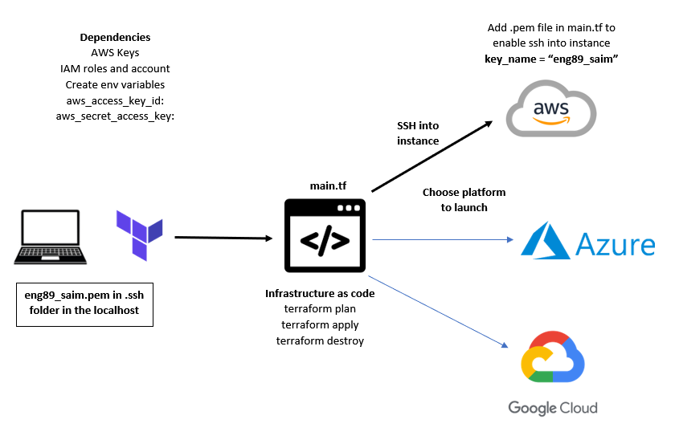
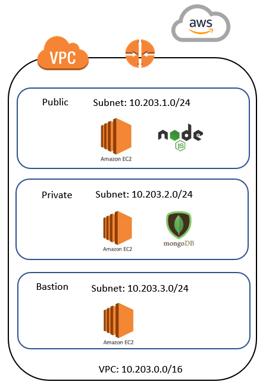
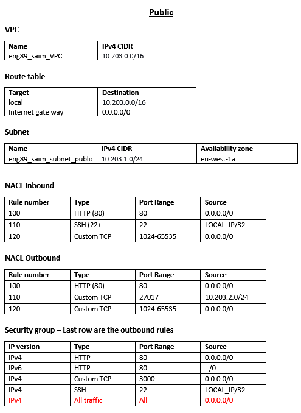
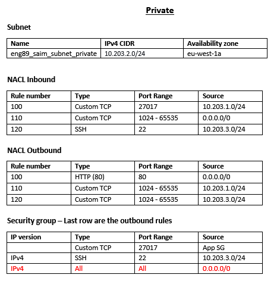
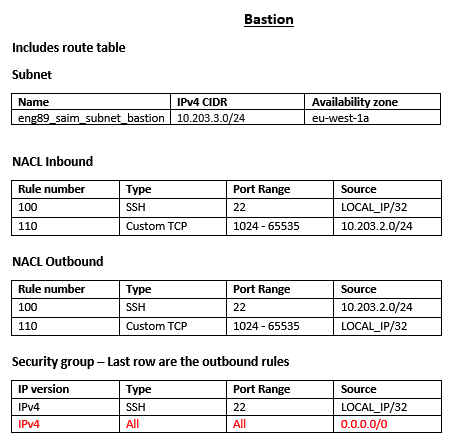

# Terraform

## What is Terraform?
Terraform is a tool for building, changing, and versioning infrastructure safely and efficiently. Terraform can manage existing and popular service providers as well as custom in-house solutions. Configuration files describe to Terraform the components needed to run a single application or your entire datacenter.

## Benefits
- Terraform modules are useful because they allow complex resources to be automated with re-usable, configurable constructs.
- Cloud independent - works with different cloud providers, allowing for multi-cloud configuration
- Can effectively scale up/down to meet the current load.
- Reduced time to provision and reduced development costs.
- Ease of use.
- Simplicity, it does a lot of work for us behind, in the background.

## Installation
- Download Terraform for the applicable platform here: https://www.terraform.io/downloads.html
- Extract and place the terraform file in a file location of your choice.
- In Search, type and select Edit the system environment variables.
- Click Environment Variables...
- Edit the Path variable in User variables.
- Click New, then add the file path of the terraform file inside

## Commands 
- `terraform init`: initialises the terraform with required dependencies of the provider mentioned in the main.tf.
- `terraform plan`: checks the syntax of the code. Lists the jobs to be done (in main.tf).
- `terraform apply`: launches and executes the tasks in main.tf
- `terraform destroy`: destroys/terminates services run in main.tf

## Creating an EC2 Instance from an AMI
- Specify some details about the instance
- To SSH into the instance you need to specify the SSH key name. 
```
# Lets build a script to connect AWS and download/setup all dependencies required
# keyword: provider aws


 provider "aws" {

        region = "eu-west-1"
}

# then we will run terraform init
# then we will move on to launch aws services
# Lets launch an ec2 in eu-west-1 with AMI
# keyword called "resource" provide resource name and give name with specific details to the service

resource "aws_instance" "app_instance" {

# resource aws_ec2_instance, name it as eng89_saim_terraform, ami, type of instance, with or without ip,

ami = "ami-038d7b856fe7557b3"
instance_type = "t2.micro"
associate_public_ip_address = true
key_name = var.aws_key_name

tags = {
Name = "eng89_saim_terraform"
 }
}

# Common commands
# terraform plan checks the syntax and validates the instruction we have provided in this script
# once we are happy and the outcome in green we can run terraform apply
```
# VPC

## Public

## Private

## Bastion


# Launching AWS services
- Running `terraform plan` will help to find any errors present in your tf file(s)
- You can separate the main.tf files into different tf files to improve readability and ease of use
- Running `terraform apply` start the process of launching the services
- Create a variable.tf file for frequently used variables throughout your code. The variables follow the format:
```
variable "VARIABLE_NAME" {
       default = "NAME_IN_CODE"
}
```
## Create a VPC
```
resource "aws_vpc" "terraform_vpc" {
  cidr_block       = "10.203.0.0/16"
  instance_tenancy = "default"

tags = {
  Name = "eng89_saim_terraform_vpc"
 }
}
```
## Create Internet Gateway and Route Table
```
resource "aws_internet_gateway" "terraform_igw" {
  vpc_id = aws_vpc.terraform_vpc.id
  
tags = {
  Name = "eng89_saim_terraform_IG"
 }
}

resource "aws_route_table" "saim_RT" {
    vpc_id = aws_vpc.terraform_vpc.id
    route {
        cidr_block = "0.0.0.0/0" 
        gateway_id = aws_internet_gateway.terraform_igw.id
    }
    
tags = {
  Name = "eng89_saim_terraform_RT"
 }
}
```
## Public and Private Subnets
```
resource "aws_subnet" "saim_public_subnet" {
    vpc_id = aws_vpc.terraform_vpc.id
    cidr_block = "10.203.1.0/24"
    map_public_ip_on_launch = "true" 
    availability_zone = "eu-west-1a"
    tags = {
        Name = "eng89_saim_subnet_public"
    }
}

resource "aws_subnet" "saim_private_subnet" {
    vpc_id = aws_vpc.terraform_vpc.id
    cidr_block = "10.203.2.0/24"
    map_public_ip_on_launch = "false" 
    availability_zone = "eu-west-1a" 
    tags = {
        Name = "eng89_saim_subnet_private"
    }
}
```
## Associate route tables with the subnet
```
resource "aws_route_table_association" "saim_public_subnet"{
    subnet_id = aws_subnet.saim_public_subnet.id
    route_table_id = aws_route_table.saim_RT.id
}
```
## Network ACL Public Subnet
```
resource "aws_network_acl" "saim_NACL_public" {
   vpc_id = aws_vpc.terraform_vpc.id
   subnet_ids = [aws_subnet.saim_public_subnet.id]

  ingress {
    protocol = "tcp"
    rule_no = 100
    action = "allow"
    cidr_block = "0.0.0.0/0"
    from_port = 80
    to_port = 80
  }

  ingress {
    protocol = "tcp"
    rule_no = 110
    action = "allow"
    cidr_block = var.my_ip
    from_port = 22
    to_port = 22
  }

  ingress {
    protocol = "tcp"
    rule_no = 120
    action = "allow"
    cidr_block = "0.0.0.0/0"
    from_port = 1024
    to_port = 65535
  }

  egress {
    protocol = "tcp"
    rule_no = 100
    action = "allow"
    cidr_block = "0.0.0.0/0"
    from_port = 80
    to_port = 80
  }

  egress {
    protocol = "tcp"
    rule_no = 110
    action = "allow"
    cidr_block = "10.203.2.0/24"
    from_port = 27017
    to_port = 27017
  }

  egress {
    protocol = "tcp"
    rule_no = 120
    action = "allow"
    cidr_block = "0.0.0.0/0"
    from_port = 1024
    to_port = 65535
  }
}
```
## Network ACL Private subnet
```
resource "aws_network_acl" "saim_NACL_private" {
   vpc_id = aws_vpc.terraform_vpc.id
   subnet_ids = [aws_subnet.saim_private_subnet.id]

  ingress {
    protocol = "tcp"
    rule_no = 100
    action = "allow"
    cidr_block = "10.203.1.0/24"
    from_port = 27017
    to_port = 27017
  }

  ingress {
    protocol = "tcp"
    rule_no = 110
    action = "allow"
    cidr_block = "0.0.0.0/0"
    from_port = 1024
    to_port = 65535
  }

  ingress {
    protocol = "tcp"
    rule_no = 120
    action = "allow"
    cidr_block = "10.203.3.0/24"
    from_port = 22
    to_port = 22
  }

  egress {
    protocol = "tcp"
    rule_no = 100
    action = "allow"
    cidr_block = "0.0.0.0/0"
    from_port = 80
    to_port = 80
  }

  egress {
    protocol = "tcp"
    rule_no = 110
    action = "allow"
    cidr_block = "10.203.1.0/24"
    from_port = 1024
    to_port = 65535
  }

  egress {
    protocol = "tcp"
    rule_no = 120
    action = "allow"
    cidr_block = "10.203.1.0/24"
    from_port = 1024
    to_port = 65535
  }
}
```
## APP Security Group
```
resource "aws_security_group" "saim_SG_app" {
  vpc_id = aws_vpc.terraform_vpc.id

  egress {
    from_port   = 0
    to_port     = 0
    protocol    = -1
    cidr_blocks = ["0.0.0.0/0"]
  }

  ingress {
    from_port   = 22
    to_port     = 22
    protocol    = "tcp"
    cidr_blocks = [var.my_ip]
  }

  ingress {
    from_port   = 80
    to_port     = 80
    protocol    = "tcp"
    cidr_blocks = ["0.0.0.0/0"]
  }

  ingress {
    from_port   = 3000
    to_port     = 3000
    protocol    = "tcp"
    cidr_blocks = ["0.0.0.0/0"]
  }

  tags = {
    Name = "eng89_saim_sg_app"
  }
}
``` 
## Database Security Group
```
resource "aws_security_group" "saim_SG_db" {
  vpc_id = aws_vpc.terraform_vpc.id

  egress {
    from_port   = 0
    to_port     = 0
    protocol    = -1
    cidr_blocks = ["0.0.0.0/0"]
  }

  ingress {
    from_port   = 22
    to_port     = 22
    protocol    = "tcp"
    cidr_blocks = ["10.203.3.0/24"]
  }

  ingress {
    from_port   = 27017
    to_port     = 27017
    protocol    = "tcp"
    security_groups = [aws_security_group.saim_SG_app.id]
  }

  tags = {
    Name = "eng89_saim_sg_DB"
  }
}
```
## App instance with provisioner file
```
resource "aws_instance" "app_instance" {
  ami = var.app_ami
  subnet_id = aws_subnet.saim_public_subnet.id
  instance_type = "t2.micro"
  associate_public_ip_address = true
  vpc_security_group_ids = [aws_security_group.saim_SG_app.id]
  key_name = var.aws_key_name

provisioner "remote-exec" {

       inline = [
              "cd app",
              "npm start"
              ]


       connection {
              type = "ssh"
              user = "ubuntu"
              private_key = file(var.aws_key_path)
              host        = self.associate_public_ip_address
         }
}

 tags = {
  Name = "eng89_saim_terraform_app"
 }
}
```
## Database Instance
```
resource "aws_instance" "db_instance" {
  ami = var.db_ami
  subnet_id = aws_subnet.saim_private_subnet.id
  instance_type = "t2.micro"
  associate_public_ip_address = false
  vpc_security_group_ids = [aws_security_group.saim_SG_db.id]
  key_name = var.aws_key_name

tags = {
  Name = "eng89_saim_terraform_db"
 }
}
```